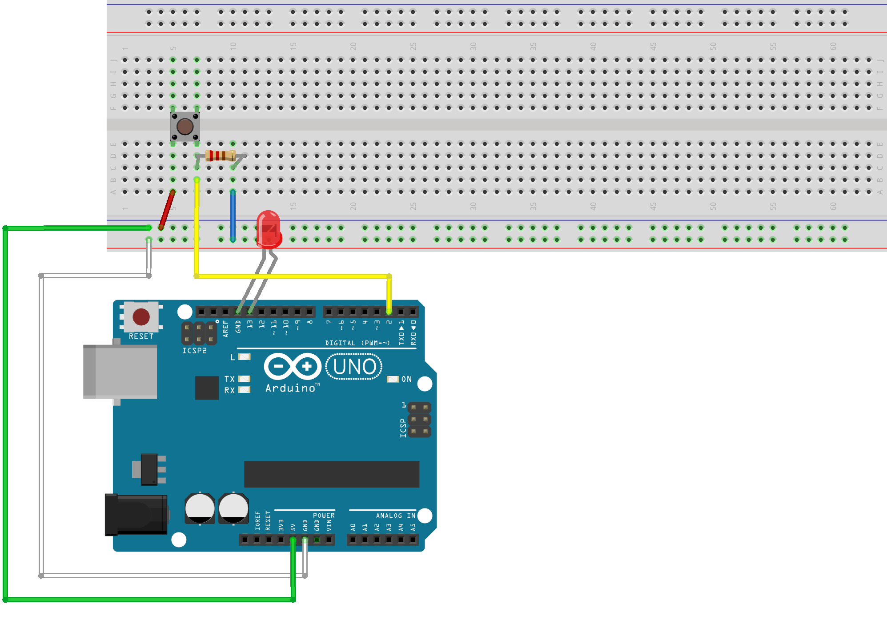

# Arduino J5

> Application using Arduino + Johnny Five + Nodejs + Socket.io to make my knowledge funnier!

## First steps

- [Install Arduino](https://www.arduino.cc/en/Main/Software)
- [Install Nodejs](https://nodejs.org/en/download/)
- [Install Johnny-Five](https://www.npmjs.com/package/johnny-five)
- [Setup your board](http://johnny-five.io/platform-support/)

## How to use

Install the dependencies:

```bash
$ npm install
```

Starting the local:

```bash
$ npm start
```

Plugging your board!

## Preview
[https://twitter.com/i/videos/tweet/859229441112887298](https://twitter.com/i/videos/tweet/859229441112887298)

## Schemas

### Proximity


### Led and Button

